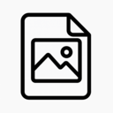

<p align="center">
	
</p>

<h1 align="center">Pixel Pirate</h1>

<p align="center">
	<strong>Download images on a web page!</strong>
</p>

## 🚀 Overview

Welcome to **Pixel Pirate**! This program allows you to download images on a web page using a simple browser extension. It is designed to be user-friendly, making it easy for anyone to download images from their internet browser without any technical knowledge.

## 🎨 Features

- **Dark Theme**: The program features a sleek dark theme that is easy on the eyes and provides a modern look.
- **Image Preview**: The program allows users to preview the images on the web page, ensuring they select the correct files before downloading.
- **Download Options**: Users can choose to download all images or select specific image filetypes to download.

## 🛠️ Installation

**Clone the Repository**
```sh
git clone https://github.com/321BadgerCode/pixel_pirate.git
cd ./pixel_pirate/
```

## 📈 Usage

To use the program, follow the steps below:

### Firefox

1. Go to [about:debugging#/runtime/this-firefox](about:debugging#/runtime/this-firefox).
2. Click on "Load Temporary Add-on".
3. Select the `manifest.json` file from the cloned repository.

## 🤝 Contributing

Contributions are welcome! If you have any suggestions or improvements, feel free to open an issue or submit a pull request.

## 📜 License

[LICENSE](./LICENSE)